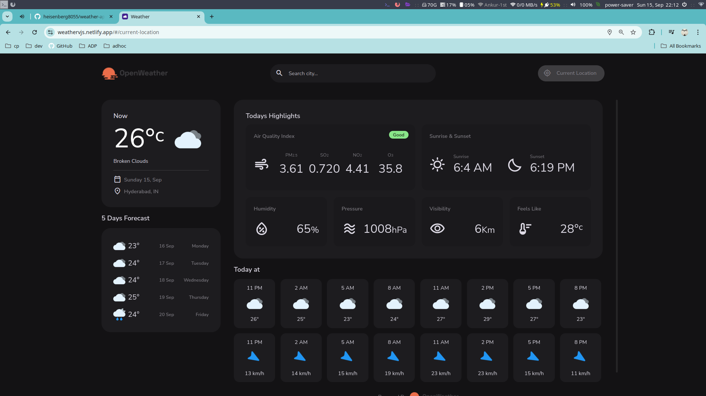
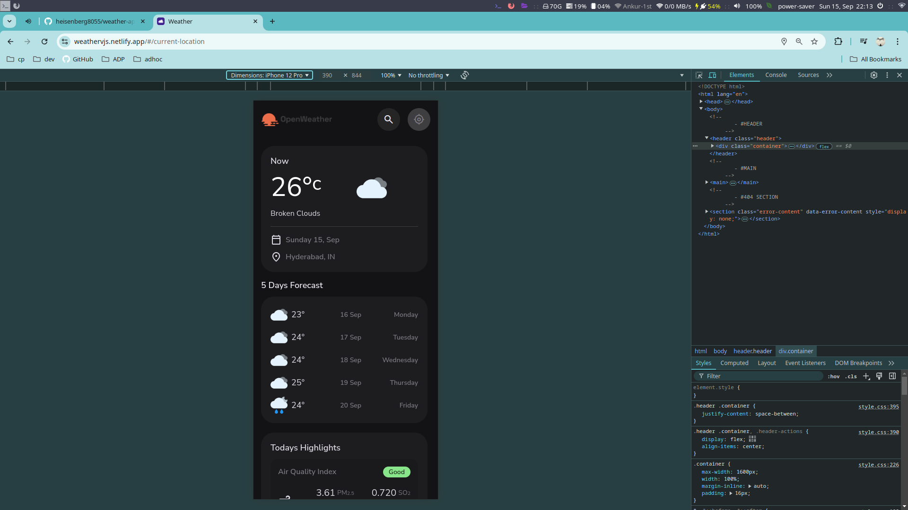

# Weather App

Built using Vanilla JS and Open Weather API

## Tech Stack

**Client:** HTML, CSS, JavaScript, API

## Demo


## Features

Weather based on various Scenarios
- Current Location
- Searched Location
- Shows 5 Days Forecast
- Media queries

## Screenshots

#### PC View


#### Mobile View


## Run Locally

Clone the project

```bash
  git clone https://github.com/heisenberg8055/weather-app
```

Go to the project directory

```bash
  cd weather-app
```

Open with VSCode

```bash
  code .
```

Open with live server

```bash
  npm run start
```


## Authors

- [@heisenberg8055](https://www.github.com/heisenberg8055)

## License

[MIT](https://choosealicense.com/licenses/mit/)